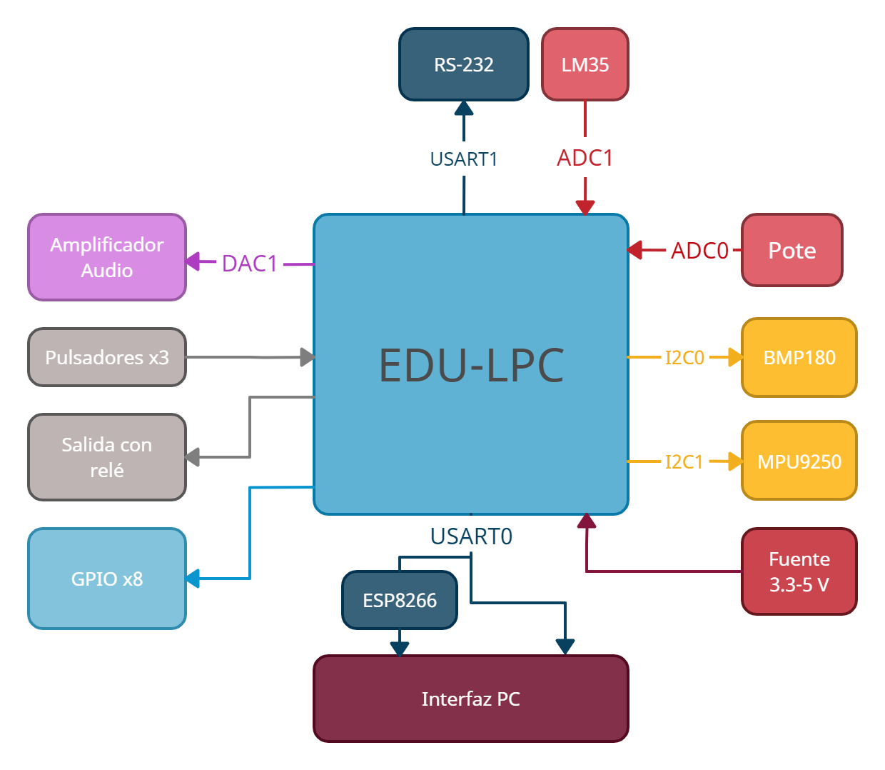

# EDU-LPC

#### **RESUMEN:** _Se plantea desarrollar una placa de desarrollo para el LPC845, con una serie de sensores y dispositivos de entrada y salida que permitan estudiar los periféricos del microcontrolador. Esta plataforma incluiría el hardware necesario para poder usar y familiarizarse con todos los periféricos y funcionalidades que ofrece el microcontrolador y la flexibilidad para agregar electrónica adicional. Habrá librerías desarrolladas en C/C++/Assembly para facilitar el uso de los periféricos y obtener resultados más fácilmente y una interfaz gráfica que permita controlar algunas de estas funciones desde una computadora._

##  1 INTRODUCCIÓN

Con el avance de los microcontroladores de 32 bits, los de 8 bits están quedando en desventaja en cuanto a performance, velocidad y precio. Aun así, es un desafío para una persona que conoce poco de programación y electrónica, poder trabajar con un microcontrolador de 32 bits. Las funciones no suelen ser tan amigables y fáciles de usar y las hojas de datos contienen mucha información que puede ser confusa.
Debido a esto surge esta idea de crear una plataforma educativa basada en el LPC845, un Cortex M0+ de 32 bits, que permita a personas con poca experiencia el poder programar un microcontrolador de este calibre sin mucha dificultad.

## 2 HARDWARE

El proyecto esta compuesto por estos componentes:

Cada uno de estos elementos cumple el propósito de permitirnos probar cada uno de los periféricos del microcontrolador sin demasiada dificultad. 

### 2.1 ENTRADAS DIGITALES

Para las entradas digitales, se van a poner a disposición algunos pulsadores o switches, además del que ya viene en la placa de desarrollo del LPC845.

### 2.2	SALIDAS DIGITALES

Una salida con relé se va a dejar libre para poder conectar cargas de alta tensión.
  
### 2.3	ADC

Además del potenciómetro incorporado en la placa de desarrollo del LPC845, también agregamos un LM35 al canal ADC1 para poder hacer mediciones de temperatura. 

### 2.4	DAC

El canal 0 del DAC se va a conectar a un amplificador de audio para a la salida poder conectar un parlante y poder reproducir audio generado desde un archivo de audio o el mismo registro del periférico.

### 2.5	USART

El USART0 va a reservarse para la comunicación con la interfaz de control en la PC, ya sea directa por USB o inalámbrica a través de un ESP8266.

Además, se va a reservar el USART1 para dejar una conexión por RS-232 con la adaptación de tensiones preparada para conectar algún otro dispositivo.

### 2.6	SPI

El SPI se va a usar para leer datos de una SD, ya sea para leer algún archivo de datos o alguno de audio para reproducir con el DAC y la salida al amplificador.

### 2.7	I2C

Con el I2C se pretende aprovechar la posibilidad de tener varios esclavos para poder establecer una comunicación con varios tipos de dispositivos. Entre estos tenemos: un Real Time Clock, un display gráfico, un sensor de presión y un acelerómetro más giróscopo.

### 2.8	GPIO

Los pines que queden disponibles son de propósito general y van a quedar disponibles a través de borneras o headers. Estos pueden servir como entradas digitales, salidas digitales o de PWM o canales de ADC o DAC extra.

### 2.9	FUENTE

Por la cantidad de dispositivos que va a tener que alimentar la placa de desarrollo, va a requerir una alimentación externa. Va a tener una entrada de 9-12V estándar para poder regular a 3,3 V y 5 V.

## 3 SOFTWARE

Dentro del proyecto, hay dos piezas de software grandes que hay que desarrollar.

### 3.1	LIBRERÍAS PARA LPC845

Uno de los propósitos de este proyecto es generar librerías que nos permitan controlar los periféricos del microcontrolador con facilidad. Basándonos en las librerías que el propio MCUXpresso ya nos brinda, la idea es poder desarrollar módulos en C++ para:

-	GPIO.
-	ADC.
-	DAC.
-	TIMERS.
-	PWM.
-	USART.
-	SPI.
-	I2C.

Además, tendremos librerías, basadas en las que ya están desarrolladas para 8 bits, para trabajar con los dispositivos que describimos en la sección anterior.

Todo esto más algunas de propósito general, permitirían a algún estudiante con poca experiencia, poder entender los principios básicos de cómo funcionan estos periféricos sin la dificultad de trabajar directamente con registros o estructuras y funciones complejas.
 
### 3.2	INTERFAZ GRÁFICA

En cuanto a la interfaz gráfica, tenemos dos posibilidades. La primera es una interfaz en C# que se puede usar con comunicación USB/USART directa al microcontrolador. La segunda es una interfaz web en Python a la que el ESP8266 puede hacerle requests.

En ambos casos, la interfaz debe ser capaz de:

-	Controlar el direccionamiento de los pines que queden libres.
-	Controlar los puertos de salida.
-	Ver el estado de las entradas digitales.
-	Visualizar la información de los sensores disponibles de alguna forma gráfica.
-	Generar PWM de una frecuencia y ancho de pulso determinado. 

## 4 VERSIONES DE ENTREGA

Debido a lo extenso del proyecto y el tiempo limitado, la propuesta es dividir esto en varias etapas funcionales listas para presentar y usarse. Las propuestas de versiones son las siguientes:

### 4.1	PRIMERA VERSIÓN

Incluye:

-	Librerías para periféricos.
-	Hardware completo.

No incluye:

-	Librerías para dispositivos conectados por USART, I2C o SPI.
-	Interfaz gráfica.

### 4.2	SEGUNDA VERSIÓN

Incluye:

-	Librerías para periféricos.
-	Librerías para sensores y dispositivos de I2C.
-	Hardware completo.
-	Interfaz en C#.

No incluye:

-	Librería para SD y comunicación con el ESP8266.
-	Interfaz gráfica web.

### 4.3	TERCERA VERSIÓN

Incluye:

-	Librerías para periféricos.
-	Librerías para todos los dispositivos conectados.
-	Hardware completo.
-	Interfaz en C# y Web.
